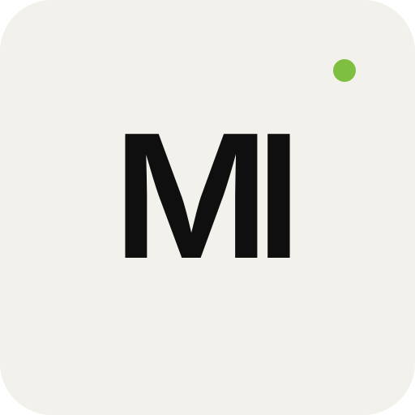

# Week 3 — Decide Once: Build Your Identity Kit

General AI Fluency — Foundations

Portfolio reference:

https://minaibrahim.tech/

---

## Identity Direction

The identity should feel:

- Technical
- Editorial
- Calm
- Minimal
- Professional
- Research-oriented

The visual system should frame the engineering work rather than compete with it.

---

## Typography

### Primary Font — Inter

Used for:

- Main headings
- Navigation
- Body copy
- Buttons
- Project descriptions
- Technical metadata

Why:

Inter is clean, highly readable, modern, and suitable for technical interfaces and engineering portfolios.

### Editorial Accent — Cormorant Garamond Italic

Used sparingly for:

- Hero emphasis
- Short editorial phrases
- Selected visual accents

Why:

It adds a research/editorial character without becoming the dominant visual language.

### Typography Rule

Use no more than these two font families.

The main portfolio remains primarily sans-serif, with the serif italic used only as an intentional accent.

---

## Color Palette

| Role | Color | Hex |
|---|---|---|
| Main / Near Black | Deep Black | `#0F0F10` |
| Background | Warm Off-White | `#F3F1EB` |
| Secondary Text | Warm Gray | `#6B6B66` |
| Accent | Soft Green | `#7FBF3F` |

### Main Color

`#0F0F10`

Used for:

- primary text
- headings
- strong buttons
- navigation

### Background

`#F3F1EB`

Used as the primary page background.

It gives the portfolio a warmer and more editorial appearance than pure white.

### Secondary

`#6B6B66`

Used for:

- metadata
- secondary text
- labels
- supporting information

### Accent

`#7FBF3F`

Used sparingly for:

- status indicators
- small highlights
- selected active states

The accent should never become louder than the engineering work.

---

## Logo / Favicon

The identity uses a simple `MI` monogram.

The logo intentionally avoids:

- AI brain symbols
- neural-network icons
- robot imagery
- complex gradients
- decorative technology symbols

The monogram keeps the identity personal, simple, and reusable.

---

## Logo Usage

Preferred:

- near-black monogram on warm off-white background
- compact square use as favicon
- simple placement in navigation or metadata

Avoid:

- shadows
- gradients
- 3D effects
- excessive animation
- multiple logo variants

---

## Two-Line Style Note

**Fonts: Inter for the core interface and Cormorant Garamond Italic for restrained editorial emphasis. Palette: #0F0F10, #F3F1EB, #6B6B66, and #7FBF3F.**

**Mood: calm, technical, editorial, and research-focused — the visual identity should frame real engineering evidence rather than compete with it.**

---

## Final Rule

> The work should always be louder than the design.
