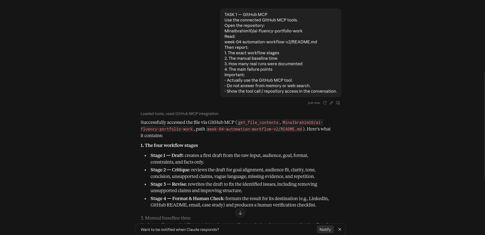
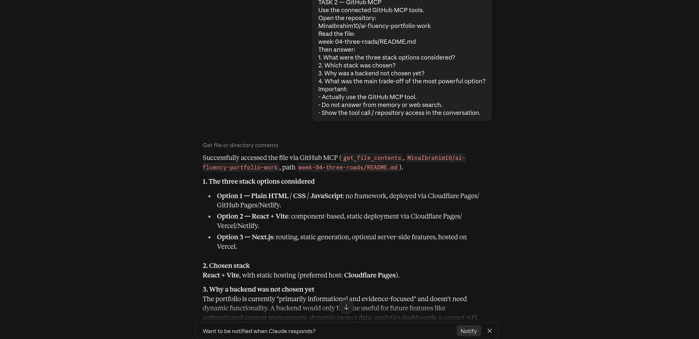
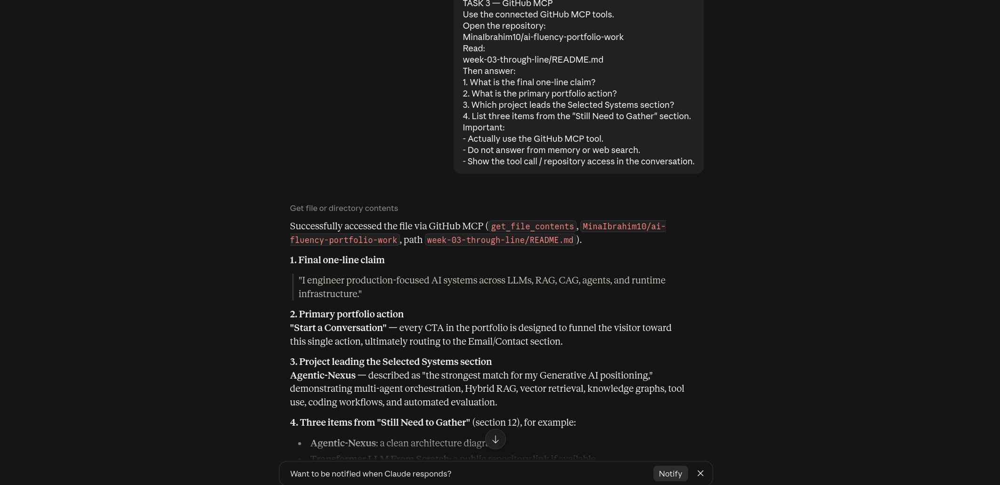

# Week 4 — Agent Concepts and MCP Basics

General AI Fluency — Build (Core)

Assignment code: FL-05

## What I Learned

The word "agent" is often used for almost any AI system that performs more than one step, but I think the useful distinction is about who controls the process.

A workflow follows a path that has already been designed. The model may generate useful content at each stage, but the overall sequence is predetermined.

An agent has more control over how it reaches the goal. Instead of always following the same path, the model can decide which steps are necessary, which tools to use, whether it needs more information, and whether it should repeat a step after seeing the result.

That difference matters because adding multiple prompts does not automatically create an agent.

---

# Workflow vs Agent

My FL-04 system is a workflow, not an agent.

Its path is fixed:

Input
→ Draft
→ Critique
→ Revise
→ Format & Human Check
→ Final Output

Every input follows those stages in the same order.

The model can improve the writing inside each stage, but it cannot decide to skip Draft, search GitHub for evidence, repeat the critique three times, check a live source, or choose a completely different route.

This makes the system predictable and easy to inspect.

That is useful for writing tasks because I already know the stages I want.

An agent would be more appropriate if the route could not be predicted in advance.

For example, suppose the goal was:

"Prepare a technically accurate portfolio case study from my current project evidence."

An agent might first inspect the supplied facts, decide that evidence is missing, search GitHub through an MCP tool, inspect a README or pull request, draft the case study, evaluate whether the claims are adequately supported, fetch more evidence if necessary, revise the text, and stop only after the evidence and output meet defined conditions.

The number and order of those steps would depend on the specific task.

---

# What MCP Is

MCP stands for Model Context Protocol.

I understand it as a standard interface that allows an AI application to connect to external data and capabilities instead of being limited to what is already inside the chat.

The useful analogy is a common connector between an AI client and external systems.

Instead of building a unique integration for every model and service combination, an MCP server can expose capabilities through a standard protocol, and an MCP-compatible client can discover and use them.

In this assignment I connected Claude to GitHub using the GitHub MCP server.

That changed what Claude could do.

Without the connector, Claude could discuss GitHub or reason from text I pasted into the conversation.

With MCP, Claude could actually access repository files through a tool call and answer questions based on the current file contents.

---

# The Three MCP Primitives

## Tools

Tools are executable functions exposed to the model.

They let the AI perform an action or retrieve information from an external system.

In my test, Claude used the GitHub MCP tool:

`get_file_contents`

to read specific files from my repository.

The important distinction is that this was not ordinary language generation. Claude made a real external tool call and used the returned repository content.

---

## Resources

Resources are data that an MCP server can expose as context.

Examples could include:

- files
- database records
- documentation
- Git history
- application data

Resources provide information that the AI or client can use without pretending that the information was already in the model's memory.

---

## Prompts

Prompts are reusable templates or structured instructions exposed through MCP.

They can provide a consistent way for a user to invoke a known task, such as a predefined review process or analysis template.

I see prompts as reusable interaction patterns, while tools provide executable capability and resources provide contextual data.

---

# My Working MCP Setup

I connected Claude to the official GitHub MCP endpoint and authenticated it with GitHub.

I then ran three tasks that ordinary chat alone could not perform because each required reading live repository content.

## Task 1 — Read FL-04 Workflow Evidence

Claude used:

`get_file_contents`

to read:

`week-04-automation-workflow-v2/README.md`

It extracted:

- the four workflow stages
- manual baseline time
- number of documented runs
- failure points

---

## Task 2 — Inspect Stack Decision

Claude used GitHub MCP to read:

`week-04-three-roads/README.md`

It extracted:

- the three stack alternatives
- the chosen stack
- why a backend was not needed yet
- the trade-off of the most powerful option

---

## Task 3 — Inspect Portfolio Through-Line

Claude used GitHub MCP to read:

`week-03-through-line/README.md`

It extracted:

- my final one-line claim
- primary portfolio action
- leading project
- items still needing evidence

---

# What FL-04 Would Need to Become an Agent

The most concrete upgrade would be to give the FL-04 system external tools and allow the model to choose its own next action.

Instead of forcing:

Draft
→ Critique
→ Revise
→ Format

I would give it a goal such as:

"Produce a publishable and evidence-supported technical description."

Then give it tools such as:

- GitHub MCP for project evidence
- web or documentation search
- file access
- optional publication or portfolio sources

The model could then decide:

1. whether enough evidence exists,
2. whether a tool call is needed,
3. which source to inspect,
4. whether another critique/revision loop is necessary,
5. when to ask me for missing information,
6. and when the task is complete.

I would also add stopping conditions and mandatory human approval before publishing.

That would change the system from a fixed writing pipeline into a model-directed process that uses environmental feedback to decide what to do next.

---

# Final Takeaway

My FL-04 build is a workflow because its route is predefined.

MCP does not automatically make something an agent. It gives an AI system access to external context and actions.

The system becomes more agent-like when the model is allowed to use those capabilities dynamically, choose its own steps based on tool results, iterate when needed, and decide how to accomplish the goal rather than simply executing a fixed sequence.
