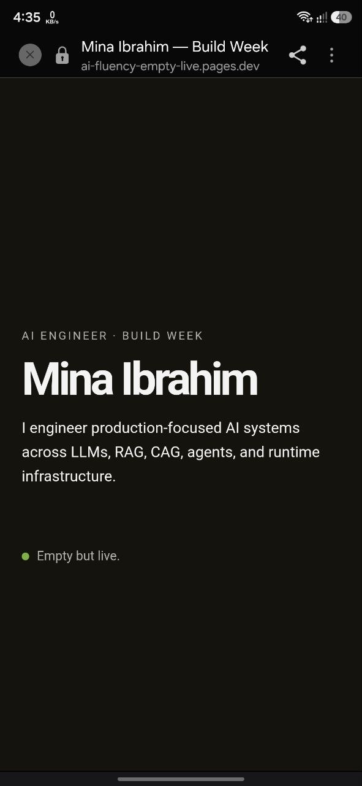

# Week 4 — Empty but Live: Ship a Blank Page

General AI Fluency — Build

## Live URL

https://ai-fluency-empty-live.pages.dev

## Stack

- HTML
- CSS
- Cloudflare Pages

The goal of this milestone was to get a real page live on a public URL before continuing the full portfolio build.

---

## Near-Blank Live Page

The page currently contains:

- My name
- AI engineering positioning
- One-line claim
- “Empty but live” status

One-line claim:

> I engineer production-focused AI systems across LLMs, RAG, CAG, agents, and runtime infrastructure.

---

## Second-Device Verification

The live URL was opened successfully on my phone, not only on my development machine.

This confirms that the page is publicly reachable.

### Mobile Proof

---

## Claude Project Preparation

My private Claude Project was prepared for the next build stage.

The following Week 3 material was added to the project:

- Identity Kit
- Through-Line / Content Map and CTAs
- Curated Images / portfolio visual decisions

This gives the build project the visual system, content structure, CTA direction, and case-study context needed for the next stage.

---

## Identity Direction

Fonts:

- Inter
- Cormorant Garamond Italic

Palette:

- Near black: `#0F0F10`
- Warm off-white: `#F3F1EB`
- Secondary text: `#6B6B66`
- Accent green: `#7FBF3F`

Mood:

Calm, technical, editorial, research-focused, and evidence-first.

---

## Primary Portfolio Action

> Contact me for AI engineering opportunities or collaborations.

The portfolio CTAs should ultimately guide visitors toward starting a conversation.

---

## Deliverable Status

- Public URL exists: complete
- Near-blank page deployed: complete
- Opened on second device: complete
- Mobile screenshot captured: complete
- Identity Kit loaded into Claude Project: complete
- Content Map / CTAs loaded into Claude Project: complete
- Case-study / visual context loaded into Claude Project: complete

## Live URL

https://ai-fluency-empty-live.pages.dev
