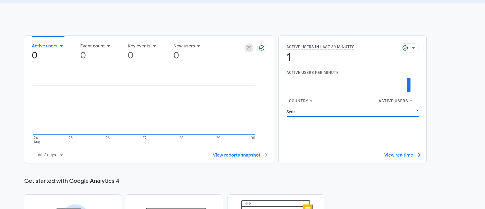

# Plant Your Flag: Domain + Badge

## Live Portfolio

https://minaibrahim.tech

## Completion Status

### Custom Domain
- Live custom domain: `minaibrahim.tech`
- Portfolio is deployed publicly using GitHub Pages.

Status: Completed

### HTTPS
- The live portfolio is accessible over HTTPS:
  `https://minaibrahim.tech`

Status: Completed

### Google Analytics 4
Google Analytics 4 was installed on the production portfolio.

Measurement ID:

`G-XZKQDW3CHR`

Portfolio implementation commit:

`ea6a1f7 Add Google Analytics tracking`

The production HTML was verified to contain the GA4 tag.

A real end-to-end analytics test was also completed:
- Portfolio opened on the live domain.
- Google Analytics received the visit.
- GA4 showed `1 active user in the last 30 minutes`.
- The realtime report identified the active user location as Syria.

Status: Installed and working

### Analytics Evidence
The screenshot below shows GA4 receiving a real visit on the live portfolio:

### Social Share Preview
The production portfolio includes:
- Open Graph title
- Open Graph description
- Open Graph URL
- Open Graph image
- Open Graph image alt text
- Twitter card metadata
- Twitter image

Canonical URL:

`https://minaibrahim.tech/`

Status: Completed

### Favicon
The production site includes a favicon.

Status: Completed

### Page Title
Current page title:

`Mina Ibrahim — AI Engineer & TensorFlow Open-Source Contributor`

Status: Completed

### Final Phone Check
The final live portfolio was opened and tested on a real phone.

Previously verified mobile improvements include:
- readable mobile typography
- improved spacing
- approximately 44px minimum interactive targets
- focus-visible accessibility styles
- responsive layout behavior

Status: Completed

## FlyRank Graduate Badge

The graduate badge has not been fabricated or replaced with an unofficial credential.

FlyRank staff stated in the assignment Q&A that the graduate badge is issued after completion certificates are available, around early September.

FlyRank also explicitly stated that interns may submit this assignment without the badge for now and update their portfolio after the badge is issued.

Therefore:

Status: Pending official FlyRank issuance

Once FlyRank issues the official graduate credential:
1. The official badge will be added to the portfolio footer.
2. It will link to the official FlyRank verification page.
3. This assignment evidence will be updated.

No Credential ID or verification URL has been invented.

## Current Rubric Status

| Requirement | Status |
|---|---|
| Custom domain | Completed |
| HTTPS | Completed |
| Analytics installed | Completed |
| Analytics working | Completed |
| Social-share metadata | Completed |
| Favicon | Completed |
| Page title | Completed |
| Final phone check | Completed |
| FlyRank graduate badge | Pending official issuance |
| Badge verification link | Pending official issuance |

## Relevant Links

Portfolio:

https://minaibrahim.tech

Portfolio repository:

https://github.com/MinaIbrahim10/mina-portfolio

Assignment repository:

https://github.com/MinaIbrahim10/ai-fluency-portfolio-work
